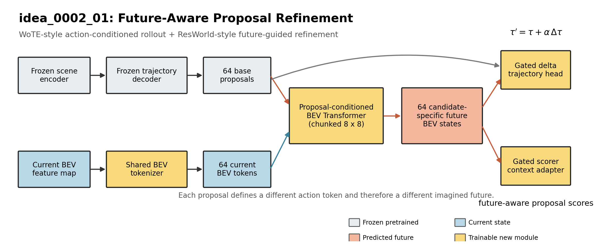
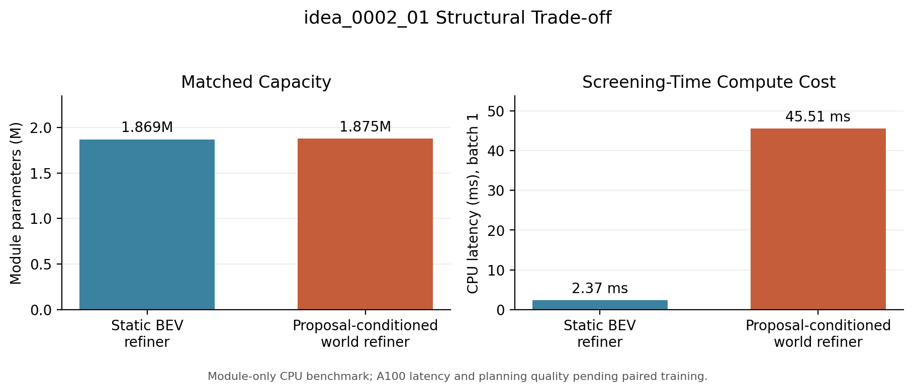
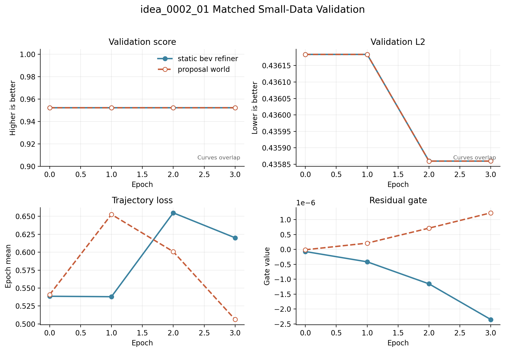
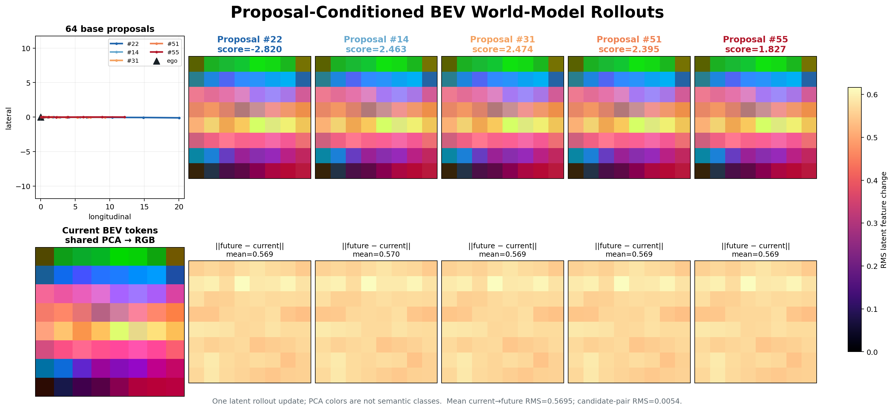
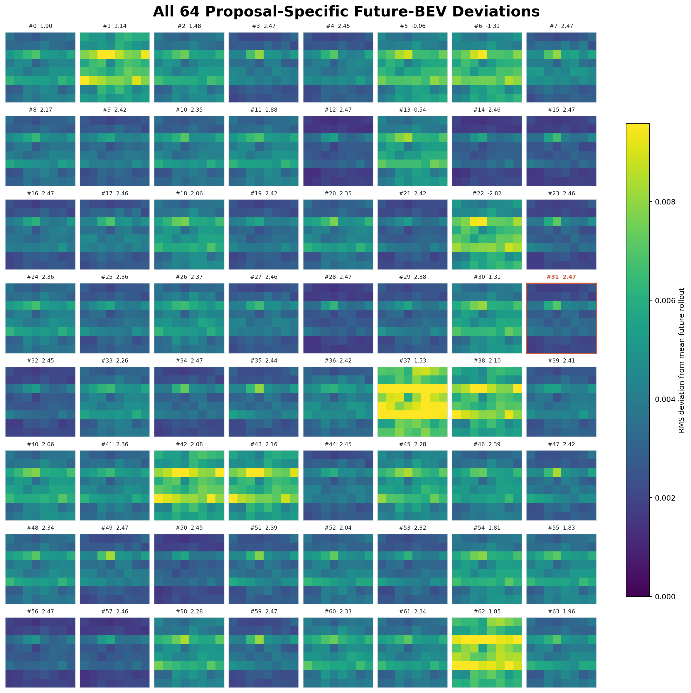

# idea_0002_01 Fast Validation

## Question

Does a proposal-conditioned BEV rollout improve frozen DrivoR proposal refinement and scoring compared with direct current-BEV residual refinement under the same small-data protocol?

## Source-Grounded Design

- WoTE duplicates the current BEV for each trajectory, injects a trajectory/action representation, and recurrently applies a Transformer encoder to produce candidate-specific future BEV states. Source: `liyingyanUCAS/WoTE`, `navsim/agents/WoTE/WoTE_model.py`, especially `_latent_world_model_processing` and `extract_reward_feature`.
- ResWorld first predicts an initial trajectory, conditions its residual latent world model on that trajectory, reconstructs a predicted future BEV by adding the residual to current BEV, and refines waypoints by attention into the predicted BEV. Source: `mengtan00/ResWorld`, `projects/mmdet3d_plugin/resworld/resworld_head.py`, lines 222-294.
- This experiment ports the intersection of those mechanisms, not either full model: frozen DrivoR proposals -> candidate-conditioned BEV Transformer -> gated trajectory delta and gated scorer context.



## Controlled Variants

| Variant | Future rollout | Proposal-conditioned | Trajectory refinement | Scorer context |
|---|---:|---:|---:|---:|
| `static_bev_refiner` | No | Path query only | Direct current-BEV cross-attention | No |
| `proposal_world` | One Transformer rollout | Yes, all 64 proposals | Candidate-future cross-attention | Candidate-future adapter |

Both variants load the same pretrained checkpoint and freeze the original encoder, trajectory decoder, trajectory heads, scorer decoder, and score heads. Only the BEV tokenizer and the selected new module are optimized.

## Small-Data Protocol

- Source token list: `trainval_decoder_neck_tokens_full_metric_covered_after_cache.txt`
- Deterministic selection: SHA256 rank of `seed:token`, seed 2
- Subset: 2,048 tokens; 1,722 train-log tokens and 326 validation-log tokens
- Split isolation: train loader is restricted to `cfg.train_logs`; validation logs are excluded from training
- Subset SHA256: `24afe47e265b15908e51b2dc1042dffc9bb029509969918caf1840584a777988`
- Per run: 4 epochs, 64 train batches/epoch, 16 validation batches/epoch
- Batch: 4/GPU, gradient accumulation 4, bf16 mixed precision
- Optimizer and LR: AdamW, configured base LR `1e-4`; effective LR is `2.5e-5` for batch 4 under the repository's square-root batch scaling
- Seed: 2
- Metric logging: local Lightning CSV at every optimizer step; purrgil W&B is available for explicit post-hoc upload

The fixed token file is generated at `exp/idea0002_fast/fixed_tokens_seed2_n2048.txt`; its adjacent JSON manifest records source and output hashes.

## Verification Evidence

| Check | Status |
|---|---|
| Zero-gate baseline parity | PASS |
| Nonzero candidate-specific wiring and output shapes | PASS |
| Chunked vs unchunked numerical equivalence | PASS |
| Two-step gate activation and world-model gradients | PASS |
| Baseline checkpoint compatibility | PASS |
| Freeze whitelist excludes pretrained model | PASS |

Full configuration trainable parameters: 6,086,426 of 46,874,008 (12.98%), including the BEV tokenizer and proposal-world module.

Module-only capacity is closely matched: 1,868,825 parameters for the static BEV refiner and 1,874,970 for the proposal-world refiner (+0.33%). On the same CPU screening benchmark (batch 1, 64 proposals, 64 BEV tokens), mean latency was 2.37 ms versus 45.51 ms. This is evidence of relative compute structure only; A100 latency is required before making a deployment claim.



## Results

Both runs used commit `c47afe7`, started from the same pretrained checkpoint with automatic resume disabled, and completed 4 epochs / 64 optimizer steps. Run UID: `08.18_purrgil_final_pair2`.

- Static output: `exp/ke/Aug18-idea0002-01-static-bev-refiner-fast/08.18_purrgil_final_pair2`
- Proposal-world output: `exp/ke/Aug18-idea0002-01-proposal-world-fast/08.18_purrgil_final_pair2`
- CPU cold start on purrgil: approximately 4.5 minutes per process.
- Cache-only subset discovery: 1.01 seconds (static) and 0.68 seconds (proposal world).
- Exact split: 1,722 train and 326 validation samples for both runs.

| Metric | Static BEV refiner | Proposal world | Delta |
|---|---:|---:|---:|
| Best `val/score_epoch` | 0.952299 | 0.952299 | 0.000000 |
| Final `val/score_epoch` | 0.952299 | 0.952299 | 0.000000 |
| Final `val/l2` | 0.4358597692 | 0.4358597677 | -1.46e-9 |
| Final `val/score_hit_rate` | 0.09375 | 0.09375 | 0.00000 |
| Final `val/top_5_score_hit_rate` | 0.359375 | 0.359375 | 0.000000 |
| Final `train/trajectory_loss` | 0.620075 | 0.506155 | -0.113921 |
| Final checkpoint refine gate | -3.00e-6 | 1.63e-6 | n/a |
| Final checkpoint score gate | n/a | -2.68e-6 | n/a |
| Mean module latency (A100, batch 1) | 0.971 ms | 9.662 ms | 9.95x |
| Peak module memory (A100, batch 1) | 16.90 MB | 21.11 MB | +24.9% |



Raw paired results and A100 benchmark JSON files are in `docs/experiments/idea0002_01_results/`.

## Latent Rollout Visualization

The final proposal-world checkpoint (`best-epoch=3-step=64.ckpt`) was inspected on validation scene `d973628ca1235533`. The model produces one 8x8 latent future-BEV token grid per proposal. The figures use a shared PCA projection for comparable latent colors and RMS feature differences; these are not semantic occupancy classes.





- Mean current-to-future latent RMS: `0.569474`
- Mean pairwise RMS across candidate futures: `0.005400`
- Refine gate: `1.6268e-6`; score gate: `-2.6762e-6`

The Transformer applies a substantial shared transformation to the current BEV, but its proposal-specific variation is about two orders of magnitude smaller. This indicates weak action conditioning in addition to the nearly closed output gates. Regenerate the plots with `scripts/viz/plot_proposal_world_rollouts.py`.

## Interpretation

The proposal-conditioned world model did not improve planning behavior under this strict zero-gate, 64-step screen. Validation score, L2, score-hit rate, and top-5 hit rate overlap at plotting precision for every epoch. The lower final proposal-world training trajectory loss is not evidence of better planning because it is noisy across epochs and does not transfer to any validation metric.

The decisive diagnostic is gate magnitude. The static alpha reached only `-3.00e-6`; proposal-world refine and score gates reached `1.63e-6` and `-2.68e-6`. Therefore both residual paths remained effectively disabled, preserving pretrained behavior and starving the deeper residual modules of useful gradients for most of this short run. The current result rejects the training configuration, not the architectural hypothesis.

The proposal-world module is parameter-matched but costs about 9.95x the isolated A100 latency of direct static-BEV refinement. A follow-up is justified only if a matched small nonzero gate initialization (for example `0.01` for both variants) produces a validation separation on the same fixed subset. If it does not, idea 0002-01 should be deprioritized before official PDMS evaluation.

These small-subset results are a hypothesis screen, not official NAVSIM PDMS/EPDMS evidence. A positive result should be followed by a larger controlled run and official NAVSIM evaluation.

Regenerate the paired JSON/CSV summary and curves with:

```bash
python scripts/evaluation/collect_idea0002_01_results.py \
  --static-csv /path/to/static/csv_logs/version_0/metrics.csv \
  --world-csv /path/to/world/csv_logs/version_0/metrics.csv
```
