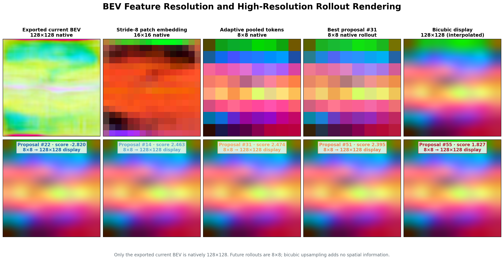
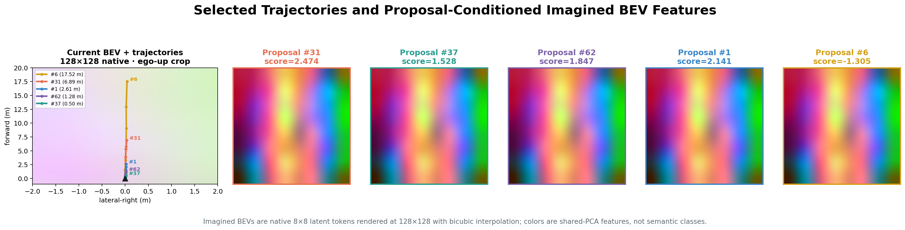

# idea_0002_01 Fast Validation

## Question

Does a proposal-conditioned BEV rollout improve frozen DrivoR proposal refinement and scoring compared with direct current-BEV residual refinement under the same small-data protocol?

## Source-Grounded Design

- WoTE duplicates the current BEV for each trajectory, injects a trajectory/action representation, and recurrently applies a Transformer encoder to produce candidate-specific future BEV states. Source: `liyingyanUCAS/WoTE`, `navsim/agents/WoTE/WoTE_model.py`, especially `_latent_world_model_processing` and `extract_reward_feature`.
- ResWorld first predicts an initial trajectory, conditions its residual latent world model on that trajectory, reconstructs a predicted future BEV by adding the residual to current BEV, and refines waypoints by attention into the predicted BEV. Source: `mengtan00/ResWorld`, `projects/mmdet3d_plugin/resworld/resworld_head.py`, lines 222-294.
- This experiment ports the intersection of those mechanisms, not either full model: frozen DrivoR proposals -> candidate-conditioned BEV Transformer -> gated trajectory delta and gated scorer context.


## Controlled Variants

| Variant | Future rollout | Proposal-conditioned | Trajectory refinement | Scorer context |
|---|---:|---:|---:|---:|
| `static_bev_refiner` | No | Path query only | Direct current-BEV cross-attention | No |
| `proposal_world` | One Transformer rollout | Yes, all 64 proposals | Candidate-future cross-attention | Candidate-future adapter |

Both variants load the same pretrained checkpoint and freeze the original encoder, trajectory decoder, trajectory heads, scorer decoder, and score heads. Only the BEV tokenizer and the selected new module are optimized.

## Small-Data Protocol

- Source token list: `trainval_decoder_neck_tokens_full_metric_covered_after_cache.txt`
- Deterministic selection: SHA256 rank of `seed:token`, seed 2
- Subset: 2,048 tokens; 1,722 train-log tokens and 326 validation-log tokens
- Split isolation: train loader is restricted to `cfg.train_logs`; validation logs are excluded from training
- Subset SHA256: `24afe47e265b15908e51b2dc1042dffc9bb029509969918caf1840584a777988`
- Per run: 4 epochs, 64 train batches/epoch, 16 validation batches/epoch
- Batch: 4/GPU, gradient accumulation 4, bf16 mixed precision
- Optimizer and LR: AdamW, configured base LR `1e-4`; effective LR is `2.5e-5` for batch 4 under the repository's square-root batch scaling
- Seed: 2
- Metric logging: local Lightning CSV at every optimizer step; purrgil W&B is available for explicit post-hoc upload

The fixed token file is generated at `exp/idea0002_fast/fixed_tokens_seed2_n2048.txt`; its adjacent JSON manifest records source and output hashes.

## Verification Evidence

| Check | Status |
|---|---|
| Zero-gate baseline parity | PASS |
| Nonzero candidate-specific wiring and output shapes | PASS |
| Chunked vs unchunked numerical equivalence | PASS |
| Two-step gate activation and world-model gradients | PASS |
| Baseline checkpoint compatibility | PASS |
| Freeze whitelist excludes pretrained model | PASS |

Full configuration trainable parameters: 6,086,426 of 46,874,008 (12.98%), including the BEV tokenizer and proposal-world module.

Module-only capacity is closely matched: 1,868,825 parameters for the static BEV refiner and 1,874,970 for the proposal-world refiner (+0.33%). On the same CPU screening benchmark (batch 1, 64 proposals, 64 BEV tokens), mean latency was 2.37 ms versus 45.51 ms. This is evidence of relative compute structure only; A100 latency is required before making a deployment claim.


## Results

Both runs used commit `c47afe7`, started from the same pretrained checkpoint with automatic resume disabled, and completed 4 epochs / 64 optimizer steps. Run UID: `08.18_purrgil_final_pair2`.

- Static output: `exp/ke/Aug18-idea0002-01-static-bev-refiner-fast/08.18_purrgil_final_pair2`
- Proposal-world output: `exp/ke/Aug18-idea0002-01-proposal-world-fast/08.18_purrgil_final_pair2`
- CPU cold start on purrgil: approximately 4.5 minutes per process.
- Cache-only subset discovery: 1.01 seconds (static) and 0.68 seconds (proposal world).
- Exact split: 1,722 train and 326 validation samples for both runs.

| Metric | Static BEV refiner | Proposal world | Delta |
|---|---:|---:|---:|
| Best `val/score_epoch` | 0.952299 | 0.952299 | 0.000000 |
| Final `val/score_epoch` | 0.952299 | 0.952299 | 0.000000 |
| Final `val/l2` | 0.4358597692 | 0.4358597677 | -1.46e-9 |
| Final `val/score_hit_rate` | 0.09375 | 0.09375 | 0.00000 |
| Final `val/top_5_score_hit_rate` | 0.359375 | 0.359375 | 0.000000 |
| Final `train/trajectory_loss` | 0.620075 | 0.506155 | -0.113921 |
| Final checkpoint refine gate | -3.00e-6 | 1.63e-6 | n/a |
| Final checkpoint score gate | n/a | -2.68e-6 | n/a |
| Mean module latency (A100, batch 1) | 0.971 ms | 9.662 ms | 9.95x |
| Peak module memory (A100, batch 1) | 16.90 MB | 21.11 MB | +24.9% |


Raw paired results and A100 benchmark JSON files are in `docs/experiments/idea0002_01_results/`.

## Latent Rollout Visualization

The final proposal-world checkpoint (`best-epoch=3-step=64.ckpt`) was inspected on validation scene `d973628ca1235533`. The model produces one 8x8 latent future-BEV token grid per proposal. The figures use a shared PCA projection for comparable latent colors and RMS feature differences; these are not semantic occupancy classes.






The selected-proposal verification compares the tokenized current BEV and all imagined BEVs using one shared PC1 basis and symmetric color range. This is required because the raw exported `128x128` feature and the post-tokenizer future features occupy different learned spaces. Relative to proposal 31, proposals 37, 62, 1, and 6 have latent RMS differences of `0.01021`, `0.00938`, `0.00779`, and `0.00787`. Their cosine similarities exceed `0.99994`, confirming that the outputs are numerically distinct but nearly collapsed rather than accidentally duplicated.

- Mean current-to-future latent RMS: `0.569474`
- Mean pairwise RMS across candidate futures: `0.005400`
- Refine gate: `1.6268e-6`; score gate: `-2.6762e-6`

The Transformer applies a substantial shared transformation to the current BEV, but its proposal-specific variation is about two orders of magnitude smaller. This indicates weak action conditioning in addition to the nearly closed output gates. Regenerate the plots with `scripts/viz/plot_proposal_world_rollouts.py`.

The exported current-BEV tensor is natively `256x128x128`. The tokenizer's stride-8 patch embedding reduces this to `16x16`, and adaptive pooling reduces it again to 64 (`8x8`) tokens. The world model predicts only at `8x8`; the 128x128 rollout renderings above use bicubic display interpolation and do not recover discarded spatial detail.

## Interpretation

The proposal-conditioned world model did not improve planning behavior under this strict zero-gate, 64-step screen. Validation score, L2, score-hit rate, and top-5 hit rate overlap at plotting precision for every epoch. The lower final proposal-world training trajectory loss is not evidence of better planning because it is noisy across epochs and does not transfer to any validation metric.

The decisive diagnostic is gate magnitude. The static alpha reached only `-3.00e-6`; proposal-world refine and score gates reached `1.63e-6` and `-2.68e-6`. Therefore both residual paths remained effectively disabled, preserving pretrained behavior and starving the deeper residual modules of useful gradients for most of this short run. The current result rejects the training configuration, not the architectural hypothesis.

The proposal-world module is parameter-matched but costs about 9.95x the isolated A100 latency of direct static-BEV refinement. A follow-up is justified only if a matched small nonzero gate initialization (for example `0.01` for both variants) produces a validation separation on the same fixed subset. If it does not, idea 0002-01 should be deprioritized before official PDMS evaluation.

These small-subset results are a hypothesis screen, not official NAVSIM PDMS/EPDMS evidence. A positive result should be followed by a larger controlled run and official NAVSIM evaluation.

## Full-Scale Nonzero-Gate Follow-up

The zero-gate screen motivated a full-data follow-up with both proposal-world output gates initialized to `0.01`. The numbers below are an interim snapshot from **2026-08-22 03:06 EDT**. The run later completed epoch 12, saved `epoch=12-step=25493.ckpt` and `last.ckpt`, then terminated during epoch 13 on 2026-08-26 after a ProcessGroupNCCL watchdog hang. The final logs also contain repeated Ray warnings that the shared filesystem was over 95% full; the logs establish temporal correlation but not that storage pressure directly caused the NCCL hang.

### Reproducible setup

- Host: `purrgil.engin.umich.edu`; 8 A100-SXM4-80GB GPUs (`CUDA_VISIBLE_DEVICES=0,1,2,3,4,5,6,7`)
- Launcher: `scripts/training/run_drivor_idea0002_01_full_8gpu.sh`
- Source revision logged at launch: `7267d33`; branch `exp/idea-0002-01-wote-fast-validation`
- Pretrained baseline: `weights/checkpoints/drivor_Nav1_25epochs.pth`; load audit reported 58 expected new-module keys and no unexpected missing or unexpected keys
- Dataset: full cached split, 125,482 training samples and 26,296 validation samples
- Per-rank batch: 4; 8 ranks; gradient accumulation: 2; global forward batch: 32; effective optimizer batch: 64
- DataLoader: 4 workers per rank (32 total), prefetch factor 1
- Training: 30 epochs, 3,921 forward batches and approximately 1,961 optimizer updates per epoch, bf16 mixed precision
- Optimizer: AdamW; configured base LR `1e-4`, effective batch-scaled LR `7.071e-5`
- Scheduler: 10% linear warmup followed by cosine decay; `dataset_size=62741` accounts for two-way gradient accumulation and gives 58,830 scheduled optimizer updates
- Proposal world: 2 Transformer layers, 4 heads, FFN width 512, one rollout step, proposal chunk size 8
- Gates: refine `0.01`, score `0.01`; trainable parameters remain the BEV tokenizer and proposal-world modules (about 6.1M)
- W&B: project `drivor-world-model`, run [`xpdaydqh`](https://wandb.ai/jonathan-twz/drivor-world-model/runs/xpdaydqh)
- Output: `exp/ke/Aug18-idea0002-01-proposal-world-full-8gpu-gates001/08.18_8gpu_full_gates001_schedfix_recache`

### Cache repair and integrity

The first full launch exposed one corrupt gzip cache entry, token `fa6bbdbd03325e34`. Its original payload was retained with suffix `.corrupt-before-recache-20260818`, the sample was recached, and both feature and target files then passed gzip and pickle loading. A complete post-repair scan finished on 2026-08-19:

- 303,556 files, 5,449,670,477,948 bytes (5,075.40 GiB)
- 0 integrity failures
- 109,646 seconds (about 30 h 27 min)
- Report: `exp/cache_integrity/20260818_1511/report.json`

### Interim metrics

| Epoch | `train/loss_epoch` | `val/score_epoch` | `val/l2` | Score hit | Top-5 hit | Refine gate end | Score gate end |
|---:|---:|---:|---:|---:|---:|---:|---:|
| 0 | 1.49127 | 0.916648 | 0.610898 | 0.05926 | 0.21175 | 0.02433 | 0.03674 |
| 1 | 1.45593 | 0.916404 | 0.601922 | 0.05470 | 0.19888 | 0.03369 | 0.05514 |
| 2 | 1.45367 | 0.915665 | 0.620379 | 0.05215 | 0.19671 | 0.03762 | 0.06875 |
| 3 | 1.44284 | **0.917410** | 0.615268 | 0.05934 | 0.21365 | 0.04209 | 0.08123 |
| 4 | 1.43679 | 0.916974 | 0.622711 | 0.05321 | 0.20006 | 0.04588 | 0.09218 |

At the snapshot, epoch 5 training was 91% complete (`3579/3921`). Its latest logged gates were approximately `0.0486` and `0.1015`. W&B history contained no NaN/Inf values and no rates outside `[0, 1]`. Negative `train/inter_loss` and `train/inter_loss0` are expected because the diversity diagnostic is implemented as negative minimum distance and has zero training weight in this configuration.

The gates now move decisively away from initialization, so the zero-gate gradient-starvation failure is resolved. However, the best validation score is `0.917410` at epoch 3, and L2 plus proposal-selection hit rates do not show a consistent improvement. This is evidence that the module is active, not evidence that it improves planning. The official NAVSIM-v1 result is reported below; NAVSIM-v2 EPDMS remains pending. Validation score is only a proxy.

`val/score_error` should not be interpreted as calibrated score error: it compares a log-domain `pdm_score` target against a linear proposal score. The logged `privileged_future_bev_valid_rate=0.79344` describes fields present in cached targets; `use_privileged_future_bev=false` means those fields are not passed into the model.

### Throughput and next decision

| Epoch | Train wall time | Validation wall time |
|---:|---:|---:|
| 0 | 17:55:15 | 03:12:39 |
| 1 | 16:07:18 | 02:15:55 |
| 2 | 12:58:29 | 02:16:35 |
| 3 | 12:58:31 | 02:16:20 |
| 4 | 12:42:18 | 02:16:09 |

The stabilized cost is roughly 15 hours per train-plus-validation epoch, implying about 19 days for 30 epochs if load and contention remain unchanged. The primary bottleneck is cache I/O and CPU deserialization, not GPU memory. A representative target contains an unused `privileged_future_bev` tensor of shape `(4,256,128,128)`, about 64 MiB uncompressed and roughly 62% of compressed sample I/O. A future cache-slimming pass can hardlink feature files and rewrite target payloads without these unused fields, but it should not interrupt this run.

Changing to per-rank batch 8 alone is not a strong reason to restart: preserve effective batch 64 with accumulation 1, explicit LR `7.071e-5`, and scheduler dataset size 125,482, then benchmark first. The measured break-even from the completed work was only about a 6.8% epoch speedup. Higher-impact follow-ups are a slim-cache benchmark, exclusive GPU allocation, and a purrgil-specific NCCL P2P benchmark; worker count is already 32 total and should not be increased blindly.

Regenerate the paired JSON/CSV summary and curves with:

```bash
python scripts/evaluation/collect_idea0002_01_results.py \
  --static-csv /path/to/static/csv_logs/version_0/metrics.csv \
  --world-csv /path/to/world/csv_logs/version_0/metrics.csv
```

## Official NAVSIM v1 Evaluation

The checkpoint with the best observed validation score was evaluated on the complete NAVSIM v1 `navtest` set on 2026-09-03:

- Checkpoint: `exp/ke/Aug18-idea0002-01-proposal-world-full-8gpu-gates001/08.18_8gpu_full_gates001_schedfix_recache/checkpoints/best-epoch=3-step=7844.ckpt`
- Selection metric: `val/score_epoch=0.917410`
- Final `last.ckpt` callback audit: epoch 3 is the global best at `0.91741037`; the remaining saved top five are epoch 8 (`0.91723996`), epoch 11 (`0.91721058`), epoch 5 (`0.91706008`), and epoch 9 (`0.91702908`)
- Evaluation launcher: `scripts/evaluation/run_drivor_proposal_world_evaluation.sh`
- Architecture: frozen pretrained encoder, original trajectory decoder, trajectory heads, scorer decoder, and score heads; trainable current-BEV tokenizer plus 2-layer, 4-head proposal-world Transformer; no LoRA
- World rollout: one step over 64 proposals, FFN width 512, proposal chunk size 8
- Refine/score gates: initialized at `0.01/0.01`; checkpoint values `0.042043/0.081296`
- Official result CSV: `exp/ke/drivoR_nav1-idea0002-01-proposal-world-best-epoch3/09.03_02.17/2026.09.03.02.38.11.csv`
- Coverage: 12,146 successful scenarios, 0 failures

| PDMS | NC | DAC | EP | TTC | Comfort | DDC |
|---:|---:|---:|---:|---:|---:|---:|
| **0.934903** | 0.989791 | 0.988721 | 0.895495 | 0.967479 | 0.999918 | 0.973078 |

Against the same-protocol pretrained baseline (`PDMS=0.936905`), the proposal-world checkpoint changes PDMS by `-0.002002`. The largest submetric change is ego progress (`-0.003925`); NC and DAC each change by `-0.000576`, while TTC (`+0.000329`) and DDC (`+0.000536`) improve slightly. This confirms that the learned gates activate the proposal-world path, but the best validation checkpoint does not improve official v1 planning quality over the pretrained model. NAVSIM v2 EPDMS remains pending.

The first evaluation attempt exposed a host-specific CUDA ordering issue: without `CUDA_DEVICE_ORDER=PCI_BUS_ID`, `CUDA_VISIBLE_DEVICES=0,1,2,4` mapped logical rank 3 to the 4 GB display GPU. The launcher now fixes PCI bus ordering and uses the shared local DINO weights. The successful rerun used four A100s, spent about 15 minutes in distributed inference and about 5 minutes in Ray PDMS scoring after the initial process startup.
